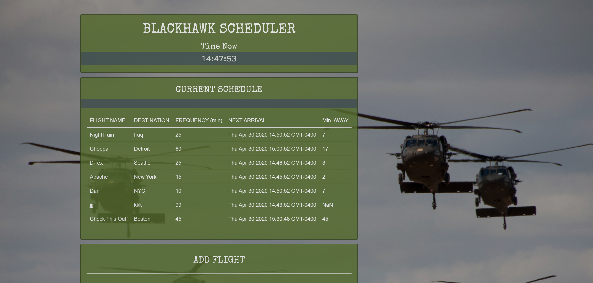

# Blackhawk Scheduler 
- ```Developer: Juan Rivera```
- ```Date: October 31, 2019```

 

## Overview
This type of project is common in many coding programs (eg, "Train Scheduler").  Due to my military background, I thought a military helicopter theme would enhance the UX moreso than the traditional train.

## UI/UX Features
The current time is prominently displayed below the header title, and two panels are used for viewing and scheduling flights. 

The top panel, labeled, "Current Schedule", tracks the flights.  It displays and keeps tracks of all flights. 

The bottom panel, labeled, "Add Flight" has input fields.  This is where the would-be flight scheduler would enter new flight details (i.e., flight name, time of first departure, and flight frequency). These flight details are calculated, then displayed on the "Current Schedule" panel.

## Built With
* [Moment.js](https://momentjs.com) for time display and manipulation.
* [Firebase](https://www.google.com) for data storage.

## Installation Steps
1. Git clone with HTTPS to your local machine ```https://github.com/JuanCodeAtATime/Blackhawk-Scheduler.git```
2. Open ```Blackhawk Scheduler``` folder 
3. Click ```index.html``` file to launch on your browser

## Watch Demo
* [Click here for demo.](https://drive.google.com/file/d/1n2EfrGH4invRLHbsqosXbFSiuuDlRwb2/view)

* [Click here to visit deployed site!](https://juancodeatatime.github.io/Blackhawk-Scheduler/)

